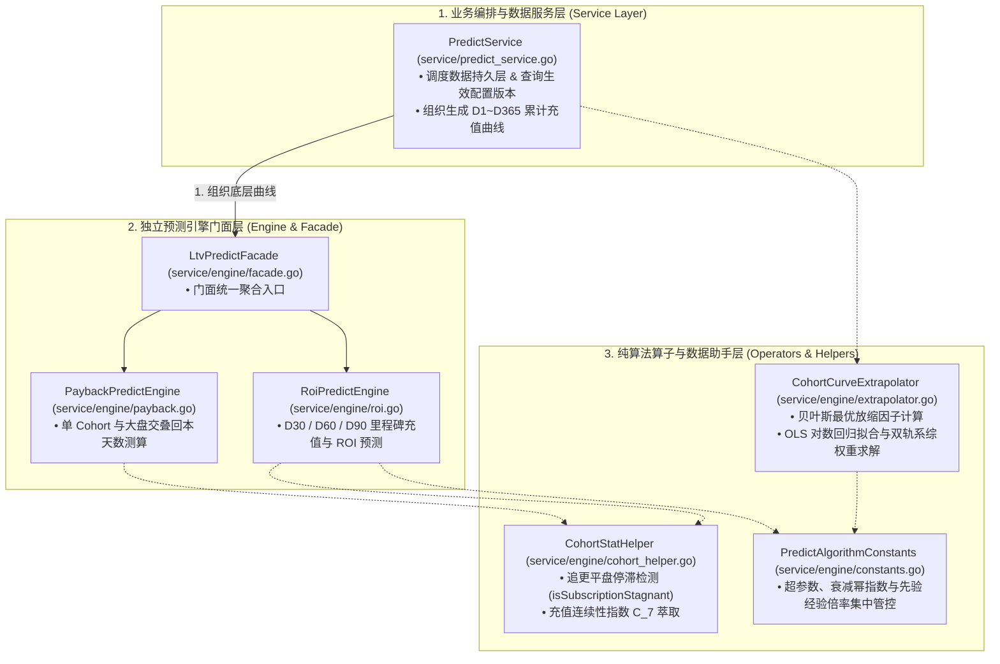
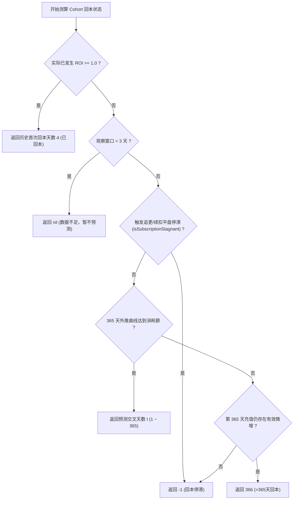

# DataLens 预测回本模型（Payback Prediction Model）技术白皮书

本文档详细阐述 **DataLens (data-lens-server)** 在海外短剧与网文多平台投流（Overseas Web Novel & Short Drama Ad Campaigns）业务场景下，**预测回本模型（Payback Prediction Model）** 的业务背景、数学原理、算法推导步骤、模块解耦架构设计与边界防守机制。

---

## 一、 业务背景与核心目标 (Business Context & Objectives)

### 1. 业务特征与难点
在海外网文与短剧广告投放中，团队主要通过 **Meta (Facebook)、TikTok、Google** 等渠道投放落地页（H5 Landing Page）进行买量获取读者（Cohort 批次）。其变现模式与传统游戏或电商存在巨大差异：
1. **复合变现模式 (Hybrid Monetization)**：
   - **单次/金币充值 (Coin Packs)**：读者在卡点章节/剧集购买金币解锁后续内容。
   - **VIP 订阅自动续扣 (Weekly/Monthly Subscriptions)**：周订（Period = 7）、月订（Period = 30）等自动周期性续费。
2. **长尾复购与划扣脉冲 (Long-tail Repeat Purchases)**：
   - **首日冲动消费**：买量首日转化率最高，充值金额集中爆发。
   - **周期划扣波峰**：忠实读者在随后的第 7 天、14 天、21 天、30 天产生周期性划扣脉冲。
3. **高敏捷决策诉求**：
   - 优化师需要根据前 **3~7 天的早期充值与续扣数据**，精准预测当前批次在未来 365 天内的 LTV 增长曲线与回本周期（Payback Period），据此决定该投放账户/素材是**翻倍加预算还是立即关停止损**。

### 2. 预测模型的核心目标
- **早期高精确度**：在 D3 / D5 / D7 观察窗口下，平均绝对误差（MAE）≤ 2.5 天，±3 天回本命中率 > 85%。
- **多订阅周期弹性适配**：原生支持周订（P=7）、月订（P=30）、日订（P=1）与单次金币充值混合交叠。
- **全方位防守与熔断兜底**：集成贝叶斯先验收缩、均值回归衰减、追更平盘停滞熔断以及 OLS 对数拟合兜底。

---

## 二、 架构设计与工程分层 (Decoupled Engine Architecture)

Go 后端服务采用 **自下而上（Bottom-Up）独立 Cohort 叠加** 与 **3 层解耦架构（编排服务层 - 独立引擎门面层 - 纯算子与状态助手层）**：

---

## 三、 核心数学算法与推导步骤 (Mathematical Derivation)

### Step 1: 网文基准曲线匹配与兜底 (Benchmark Baseline Matching)

针对 Cohort 中解析出的主导订阅周期 $P$（单次/日订 $P=1$, 周订 $P=7$, 月订 $P=30$ 等）：
1. **订阅套餐版本动态挂接**：
   优先根据当前 Cohort 上线时间 `launchTime` 从 `subscription_config_version` 匹配当时的生效价格配置：
   $$\text{Price}_{\text{first}} = \frac{\text{FirstPriceCent}}{100.0}, \quad \text{Price}_{\text{renew}} = \frac{\text{RenewPriceCent}}{100.0}$$
2. **历史大盘真实基准线匹配 (Empirical Baseline)**：
   从数据库匹配该落地页/渠道维度由历史成熟 Cohort（Age ≥ 14 天）萃取出的留存率 $\text{baseRet}[d]$ 与单客 $\text{baseArpu}[d]$。
3. **合成基准线兜底 (Synthetic Standard Benchmark Fallback)**：
   若无历史基准数据，启用合成基准模型：
   - **周订 / 月订**：在划扣周期节点 $d = 1, P+1, 2P+1, \dots$，按指数衰减建模：
     $$\text{baseRet}[d] = 0.55^{\text{cycleIndex} - 1}$$
   - **单次/日订**：按网文流失幂律建模：
     $$\text{baseRet}[d] = \frac{1}{d^{0.75}}$$
   - **90 天后完本尾部长尾衰减**（$d > 90$）：
     $$\text{baseRet}[d] = \text{baseRet}[90] \times \left(\frac{90}{d}\right)^{1.2}$$

---

### Step 2: 动态客单萃取与放缩因子计算 (`computeOptimalScaleFactor`)

设当前批次已知观察天数为 $T_{\text{obs}} = \min(\text{daysElapsed}, 60)$，实际累计 ROI 与基准预期 ROI 总和分别为：
$$\text{ActualROI} = \frac{\text{ActualRecharge}}{\text{Spend}}, \quad \text{BaseROISum} = \sum_{d=1}^{T_{\text{obs}}} \frac{\text{baseRet}[d] \times \text{UnitPrice}_d \times N}{\text{Spend}}$$

#### 1. 单客充值力 (Realized ARPU) 贝叶斯动态萃取
对于大额高频充值批次，单客真实充值水平可能显著偏离均值，系统通过贝叶斯吸收当前真实充值力：
$$\text{RealizedARPU} = \frac{\text{ActualRecharge}}{N \times \sum_{d=1}^{T_{\text{obs}}} \text{baseRet}[d]}$$
$$\text{EffectiveARPU} = w_{\text{arpu}} \cdot \text{clamp}(0.5 \cdot \text{BaseARPU}, 8.0 \cdot \text{BaseARPU}, \text{RealizedARPU}) + (1 - w_{\text{arpu}}) \cdot \text{BaseARPU}$$
其中时间与样本置信度权重 $w_{\text{arpu}} = \text{timeWeight}(T_{\text{obs}}) \times \frac{N}{N + 5.0}$（7 天以内 $w_{\text{arpu}} = 0$ 保证早期风控，14 天后平滑升至 0.85）。

#### 2. 放缩因子贝叶斯先验收缩
- **极早期（$T_{\text{obs}} \le 7$ 天）**：
  引入消耗加权先验收缩，防范小消耗大充值导致预测虚高：
  $$\alpha = \frac{\text{ActualROI} + \text{PriorWeight}}{\text{BaseROISum} + \text{PriorWeight}}, \quad \alpha \in [0.80, 1.25]$$
  贝叶斯收缩权重：$w = 0.15 + 0.10 \times \frac{T_{\text{obs}}}{7}$。
- **成熟期常规批次（$T_{\text{obs}} > 7$ 天）**：
  $$\alpha \in [0.60, 2.00], \quad w = 0.85 + 0.10 \times \frac{\min(46, T_{\text{obs}} - 14)}{46}$$
- **小样本活跃大户自适应松绑（$N \le 5$ 且连续充值占比 $C_7 \ge 0.70$ 且 $\text{ROI} \ge 0.40$）**：
  识别到大额连续复购读者后，放缩上限动态松绑至 `3.50`，远期衰减幂指数放宽至 `0.15`。

最终放缩因子：
$$\text{ScaleFactor} = w \cdot \alpha + (1.0 - w) \cdot 1.0$$

---

### Step 3: 未来 365 天充值曲线推导与双轨系综融合 (Ensemble)

从 $t = T_{\text{obs}} + 1$ 至 $365$ 天逐日外推：

1. **轨道 A：留存衰减基准外推曲线**：
   - 放缩系数向 1.0 平滑回归衰减：$\text{scaleDecay}(t) = \left(\frac{T_{\text{obs}}}{t}\right)^{\text{SCALE\_DECAY\_EXPONENT}}$
   - 周期续订自然衰减：$\text{cycleDecay}(t) = \left(\frac{7}{t}\right)^{\text{CYCLE\_DECAY\_EXPONENT}} \quad (t > 7)$
   - 单日预测充值增量：
     $$\Delta R(t) = \text{baseRet}[t] \times [1.0 + (\text{ScaleFactor} - 1.0) \times \text{scaleDecay}(t)] \times \text{cycleDecay}(t) \times \text{EffectiveARPU} \times N$$
2. **轨道 B：成熟期 (D14+) 双轨 OLS 动量动态系综融合**：
   当 $T_{\text{obs}} \ge 14$ 且历史累计充值对数拟合优度 $R^2 \ge 0.85$ 时，激活系综融合：
   $$\text{CumRecharge}[t] = (1 - \lambda) \times \text{CumRecharge}_A[t] + \lambda \times [\text{Spend} \times (a \cdot \ln(t) + b)]$$
   其中融合权重 $\lambda \in [0, 0.45]$ 动态由 $R^2$ 与数据成熟度决定。

---

## 四、 边界条件与风控熔断机制 (Safeguards & Edge Cases)

### 1. 通用订阅/复购平盘停滞判定 (`isSubscriptionStagnant`)
根据 Cohort 解析出的主导周期 $P$，动态计算平盘判定窗口：
$$\text{RequiredFlatDays} = \max(6, P \times 2)$$
- **单次/日订** ($P \le 3$)：连续 6 天充值增量 $\le \$0.01$，表明读者流失停读，判定为停滞；
- **周卡/周订** ($P = 7$)：连续 14 天（两期）充值增量 $\le \$0.01$，表明连续两周未发生续费，判定为停滞；
- **月卡/月订** ($P = 30$)：连续 60 天（两期）充值增量 $\le \$0.01$，判定为停滞。
触发停滞后未来充值曲线锁定为平盘，预测回本天数返回 `-1`。

### 2. 首充冲动型断崖衰竭保护 (Impulse Dropoff Detection)
在 $D3 \sim D5$ 早期观察期，若检测到用户在首日大额充值后后续充值断崖停滞：
$$\text{Recharge}(D3) \le \text{Recharge}(D1) \times 1.05$$
引擎自动施加 $0.70$ 的流失折价系数，彻底杜绝首日高充值导致的早期盲目乐观。

### 3. 时间自适应弹性上下界保护 (Elastic Dynamic Bounds)
废除硬编码的静态 ROI 天花板，基于当前达成 ROI 与剩余天数动态推导理论上限：
$$\text{MaxROI}_{30}(t) = \text{ActualROI}(t) \times \left(1.0 + 2.2 \sqrt{\frac{30 - t}{30}}\right) + 0.08 \times \left(\frac{30 - t}{30}\right)$$

### 4. 自然日历对齐大盘回本计算 (`calculateOverallPaybackDays`)
对于包含多个跨时间上线广告组的整体大盘，系统采用 **自下而上（Bottom-Up）自然日历对齐算法**：
- 将每个独立 Cohort 的预测充值曲线投影到其各自对应的自然日历日期上；
- 逐日累加全盘各批次在自然日历当天的充值现金流；
- 当自然日历上的累计流水总和达到全部批次总消耗时，计算距离今日的剩余回本天数。

---

## 五、 Go 后端核心实现代码映射表

| Go 代码文件路径 | 结构体 / 核心函数 | 算法职责与说明 |
| :--- | :--- | :--- |
| `internal/service/predict_service.go` | `PredictCohortDailyRechargeCurve` | 服务层调度入口，装配基准线并生成完整 D1~D365 逐日曲线 |
| `internal/service/engine/facade.go` | `AssembleCohortPrediction` / `AssembleOverallPrediction` | 预测引擎门面，分发调用回本与 ROI 引擎并组装统一结果 |
| `internal/service/engine/payback.go` | `CalculateCohortPaybackDays` / `CalculateOverallPaybackDays` | 单批次与自然日历跨批次交叠回本天数精确求解器 |
| `internal/service/engine/roi.go` | `CalculateCohortRoiTrend` | D30 / D60 / D90 预测、首充断崖折扣与到达真实值自适应修正 |
| `internal/service/engine/extrapolator.go` | `ComputeOptimalScaleFactor` / `ComputeOlsFit` | 贝叶斯放缩因子、双轨 OLS 对数拟合与系综加权算子 |
| `internal/service/engine/cohort_helper.go` | `IsSubscriptionStagnant` / `GetRechargeContinuityRatio` | 数据提取助手、充值连续性指数与平盘停滞熔断判断 |
| `internal/service/engine/constants.go` | `PredictAlgorithmConstants` | 算法超参数、衰减幂系数与先验经验增长倍率集中配置管理 |

---

## 六、 总结与价值

DataLens 预测回本模型在深度契合**海外买量与混合变现（单次解锁 + 订阅周期划扣）**业务规律的基础上，实现了**极高的早期推演精度与数学自洽性**。解耦后的纯 Go 原生实现不仅保证了极高的并发计算性能与内存安全性，更为后续持续接入新平台（如 TikTok 直投、Google App Campaigns）和扩展新型变现模式提供了灵活、坚固的算法底座。
